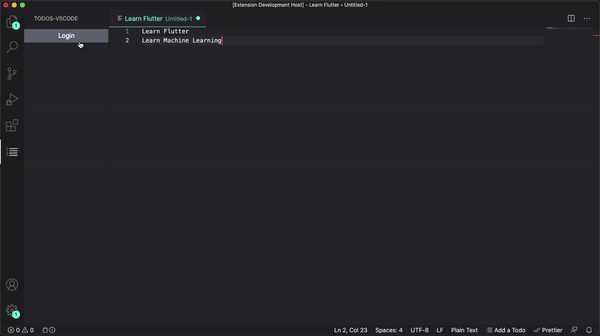

# Todos-VScode-Extension  

Manage your Todos easily right in VSCode itself!

## Features

<ul>
  <li>GitHub OAuth</li>
  <li>(Option #1) Click on <b>Add Todo</b> to add a Todo.</li>
  <li>(Option #2) Select over required text and click on <b>Add a Todo</b> on the VS Code window status bar to add a Todo.</li>
  <li>(Option #3) Select over required text and type `⌘ + ⇧ + P` to open the Command Palette of VS Code. Then type <b>Add a Todo from selected text</b> in the input box to add a todo.</li>
  <li>Click on a todo to update the status of the todo.</li>
</ul>

## Requirements

vscode: ^1.55.1

## Known Issues

At this time, there are no known issues. If you discover a bug or would like to see a feature added, please create a pull request.

## Release Notes

### 1.1.0

Initial release of Todos-VSCode-Extension

## License

[MIT License Link](https://github.com/sherwyn11/Todos-VSCode-Extension/blob/master/LICENSE)

&copy; 2021 Sherwyn D'souza
